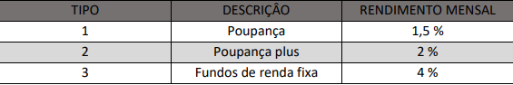

# CadastrodeContas
Desafio1 Nitech

Uma agência bancária possui vários clientes que podem fazer investimentos com
rendimentos mensais, conforme a tabela a seguir:

Faça um programa que leia o código do cliente, o tipo da conta e o valor investido e que
calcule e mostre o rendimento mensal de acordo com o tipo do investimento. Ao final
do programa mostre o total investido e o total de juros pagos.
A leitura terminará quando o código do cliente digitado for menor ou igual a 0.

